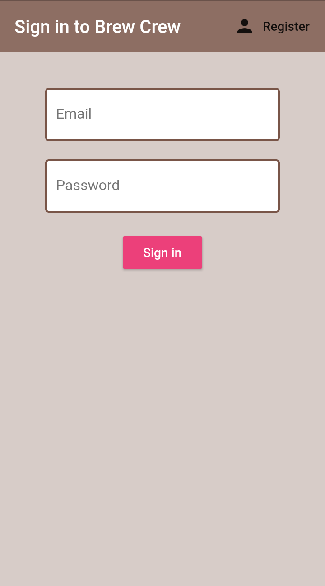
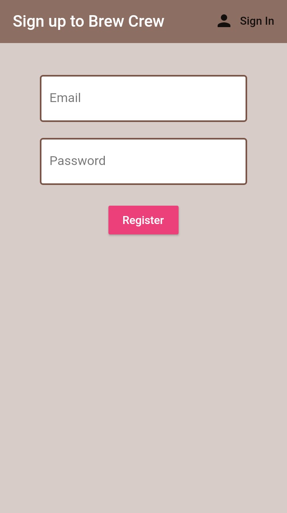
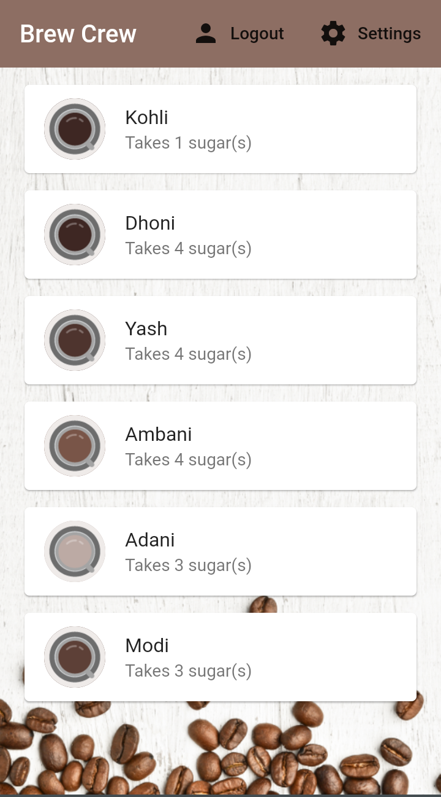
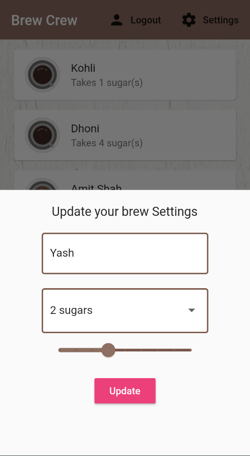

# Brew_Crew

A Flutter project.

## Getting Started

This project is a Flutter application using Firebase as Backend.

It allows a group of users to store their preferences for coffee. Preferences like Number of Sugar cubes, Strength of coffee can be stored.

# UI of App

           

